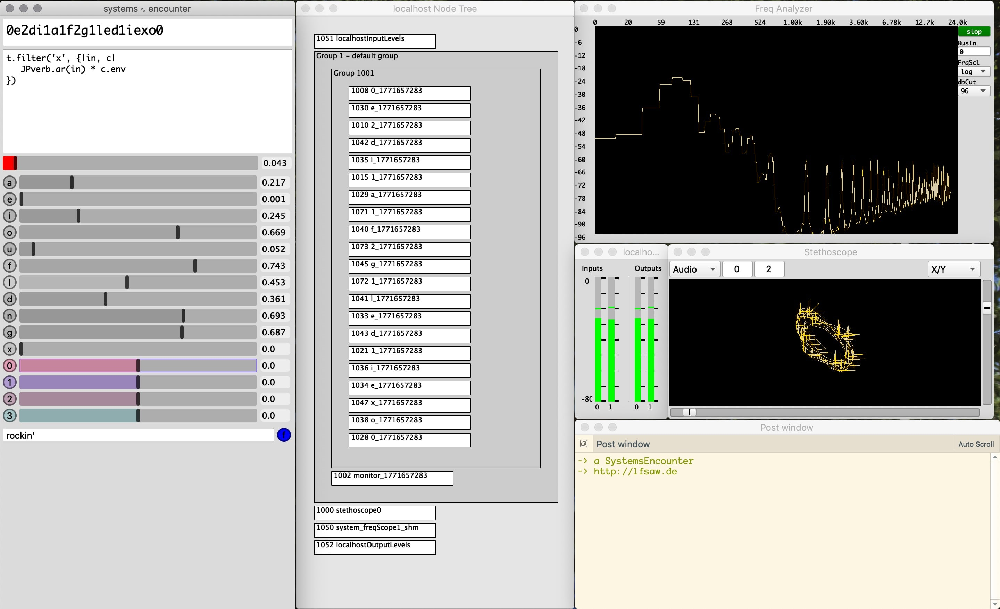
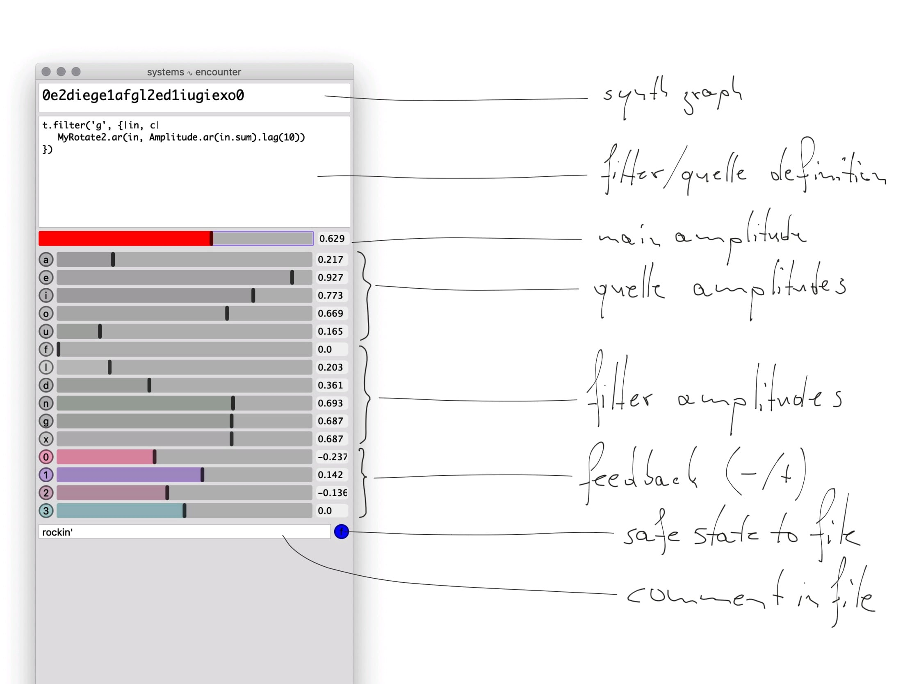

# systemsEncounter
2018,2019, Till Bovermann ([interaction](http://tai-studio.org) | [music](http://lfsaw.de))

A livecoding environment based on [Steno](https://github.com/musikinformatik/Steno)

See [example setup](ExampleSetup/SE_setup-2chan.scd) for details.

## GUI

